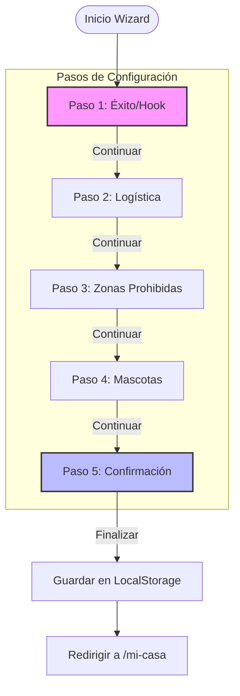
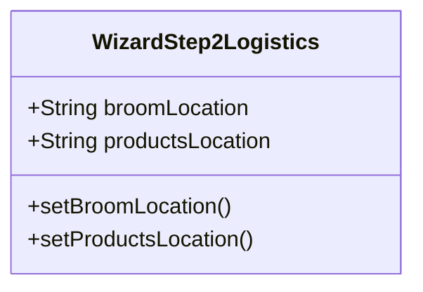
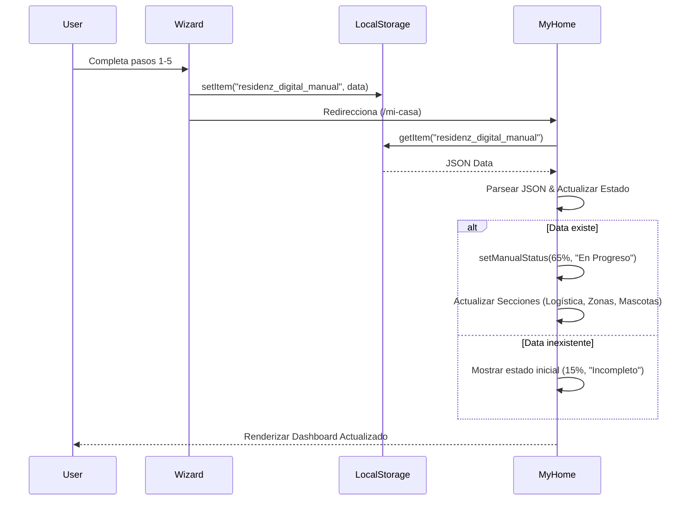

# Documentación del Manual Digital y Dashboard "Mi Casa"

Esta documentación detalla la arquitectura, flujo y componentes del sistema "Manual Digital" de Residenz. El sistema permite a los usuarios configurar sus preferencias, zonas prohibidas y logística del hogar para automatizar y personalizar el servicio de limpieza.

## Visión General

El sistema consta de dos partes principales:
1.  **DigitalManualWizard**: Un asistente paso a paso para la configuración inicial (Onboarding).
2.  **Mi Casa (Dashboard)**: Un panel de control para ver y gestionar la configuración guardada.

La persistencia de datos se maneja actualmente a través de `localStorage` bajo la clave `residenz_digital_manual`, permitiendo una comunicación fluida entre el asistente y el dashboard.

---

## 1. Digital Manual Wizard (Asistente de Configuración)

El Wizard guía al usuario a través de 5 pasos clave para configurar su hogar.

### Arquitectura del Wizard
El componente `DigitalManualWizard.tsx` actúa como orquestador, manteniendo el estado global del formulario y delegando la renderización de cada paso a sub-componentes especializados ubicados en `src/components/wizard/`.

### Diagrama de Flujo del Wizard (Mermaid)



### Detalle de Pantallas (Componentes)

#### Paso 1: Confirmación de Suscripción (`WizardStep1Success`)
Pantalla de bienvenida que confirma la suscripción y motiva al usuario a configurar su "Piloto Automático".
*   **Acción Principal**: Botón "ACTIVAR MANUAL DIGITAL".
*   **Estado**: No manipula datos, solo transición.

#### Paso 2: Logística (`WizardStep2Logistics`)
Configuración de ubicación de herramientas y productos.
*   **Datos Capturados**:
    *   `broomLocation`: Ubicación de utensilios (Cocina, Lavandería, Baño).
    *   `productsLocation`: Ubicación de productos (Cocina, Lavandería, Baño).



#### Paso 3: Zonas Prohibidas (`WizardStep3Zones`)
Permite al usuario listar áreas donde el personal no debe entrar.
*   **Datos Capturados**:
    *   `restrictedZones`: Array de strings (ej. "Oficina", "Cuarto de servidores").
*   **Interacción**: Input de texto con botón de agregar (+) y lista con opción de eliminar.

#### Paso 4: Mascotas (`WizardStep4Pets`)
Registro de mascotas para que el personal sepa cómo interactuar.
*   **Datos Capturados**:
    *   `pets`: Array de objetos `{name, type}`.
*   **Interacción**: Input de nombre y selector de tipo (Perro, Gato, Otro).

#### Paso 5: Confirmación (`WizardStep5Confirmation`)
Pantalla final "Pilot Mode Activated" que confirma la seguridad y encriptación de las instrucciones.
*   **Acción**: Guarda todo el estado acumulado en `localStorage` y redirige.

---

## 2. Dashboard "Mi Casa" (`MyHome.tsx`)

El dashboard es el centro de mando donde el usuario visualiza el estado de su Manual Digital. Lee los datos persistidos y actualiza la UI dinámicamente.

### Flujo de Datos



### Estructura de Datos (JSON en LocalStorage)

```json
{
  "status": "active",
  "logistics": {
    "broomLocation": "Lavandería",
    "productsLocation": "Baño"
  },
  "zones": ["Oficina Principal", "Sótano"],
  "pets": [
    { "name": "Firulais", "type": "Perro" }
  ],
  "lastUpdated": "2024-05-20T10:30:00.000Z"
}
```

### Componentes de UI en Dashboard
1.  **Header con Pilot Mode**: Toggle visual (simulado) para activar/desactivar el modo piloto.
2.  **Barra de Estado**: Muestra el porcentaje de completitud del manual (calculado dinámicamente si hay datos).
3.  **Grid de Secciones**: Tarjetas interactivas para cada módulo (Logística, Zonas, Mascotas).
    *   Muestran un resumen del contenido (ej. "Lavandería (Escoba)...").
    *   Indicador de estado (Configurado vs Pendiente).

---

## Relación Técnica

La relación entre ambos módulos es **desacoplada pero sincronizada por datos**.

*   **Escritura**: El `DigitalManualWizard` es el único *escritor* principal de la configuración completa.
*   **Lectura**: `MyHome` actúa como *lector* y presentador de esta información.
*   **Extensibilidad**: Para agregar una nueva sección (ej. "Alarmas"), se debe:
    1.  Crear `WizardStepXAlarmas.tsx`.
    2.  Agregar estado en `DigitalManualWizard.tsx`.
    3.  Incluir el dato en el objeto `manualData` al guardar.
    4.  Agregar la sección correspondiente en el array `sections` de `MyHome.tsx` y su lógica de lectura.
